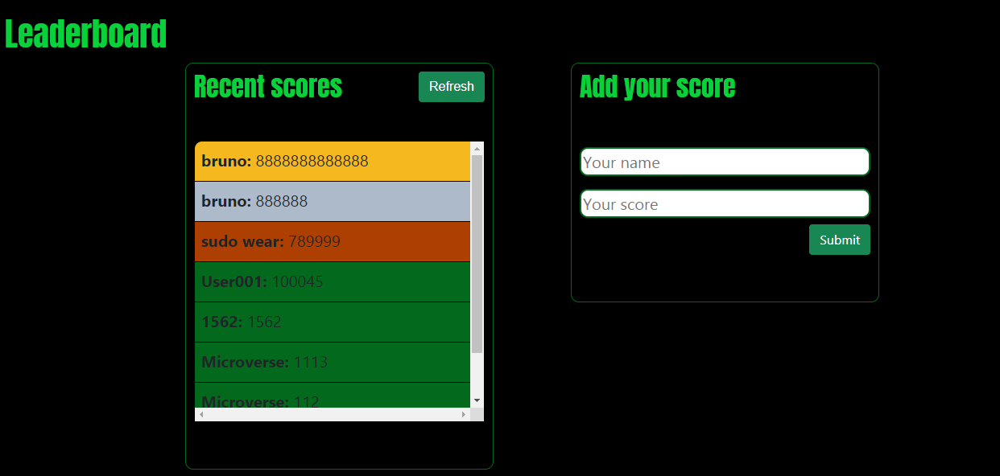

# Leaderboard

> This project is a leaderboard fed through a form that serves me to learn to connect my project to API's and async code.



## Built With

- Major languages
    - JavaScript ES6
    - HTML & CSS
- Frameworks
    - Webpack
    - Bootstrap
- Technologies used
    -VSCode
    -Node.js

## Getting Started

To get a local copy up and running follow these simple example steps.

### Prerequisites

- Have the latest version of Node on your local computer
- Have git bash on your local computer
- Have a code editor

### Setup

- Open git bash on any folder
- Clone this repo using ```git clone https://github.com/JuliCarracedo/leaderboard.git ```
- Open the created folder in your editor (```code .```or ```atom .``` in git bash if you have any of those

### Install

- Run ```npm install``` in your integrated console to install dependencies.

### Usage

- Run ```npm start``` in your integrated console to open the application in your browser
- Now you can add any amount of scores to the leaderboard!
    - Numbers can't be negative
    - Fields can't be empty
    - Changes will persist after reload
    - Scores will be organized in descending order after reload.
## Author

👤 **Julian Carracedo**

- GitHub: [@JuliCarracedo](https://github.com/JuliCarracedo)
- Twitter: [@CarracedoTrigo](https://twitter.com/CarracedoTrigo)
- LinkedIn: [Julian Carracedo](https://linkedin.com/in/julian-carracedo)

## 🤝 Contributing

Contributions, issues, and feature requests are welcome!

## Show your support

Give a ⭐️ if you like this project!

## 📝 License

This project is [MIT](./MIT.md) licensed.
